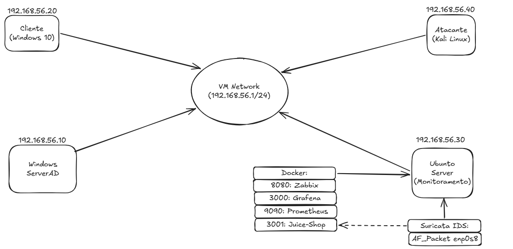
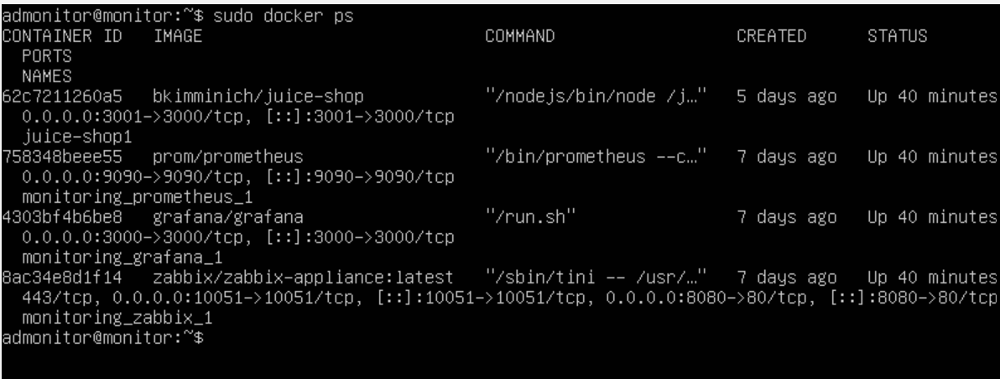
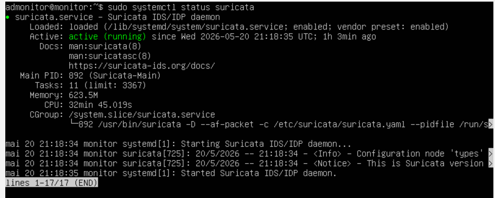
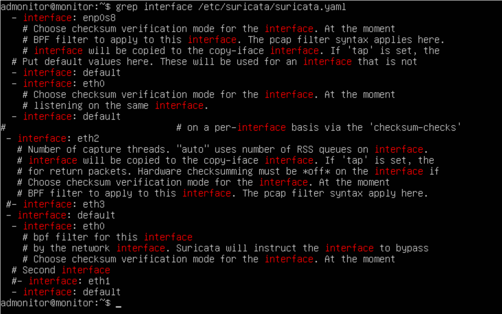
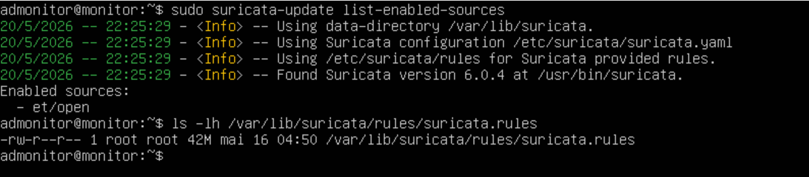
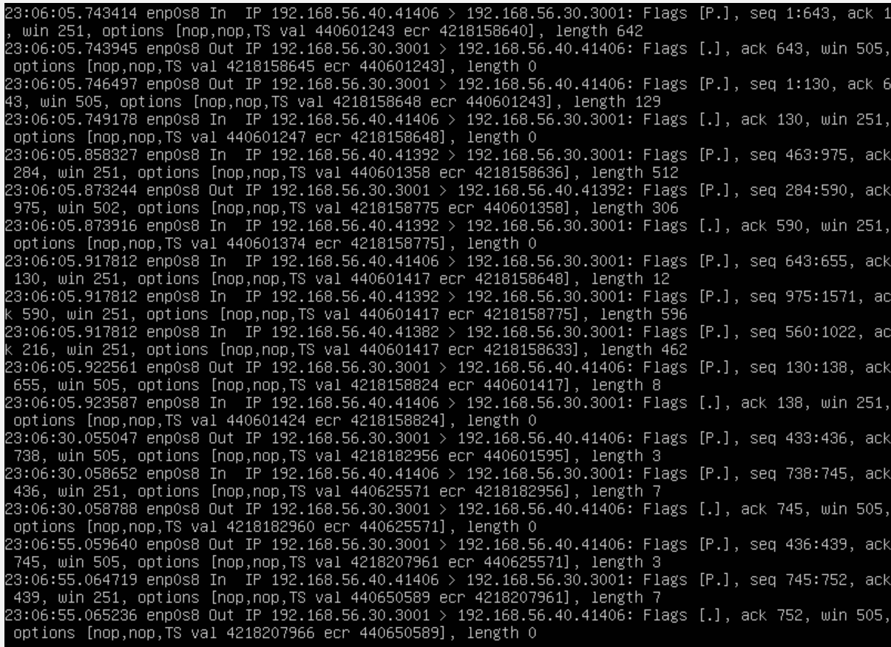
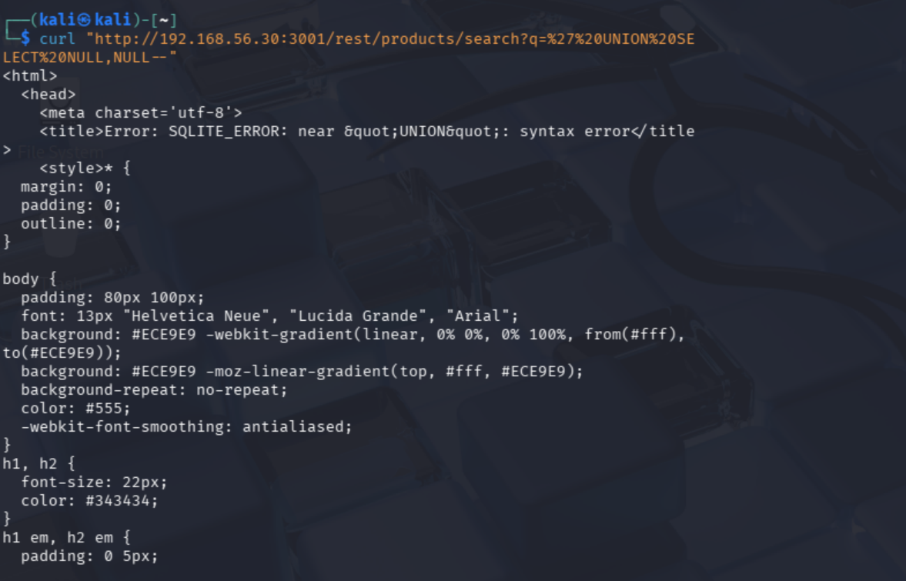
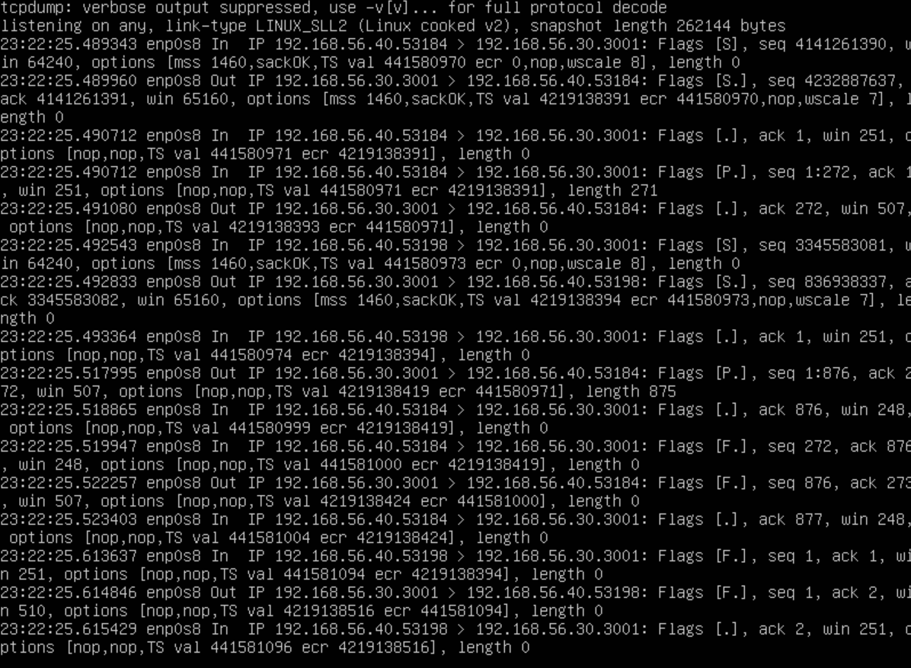
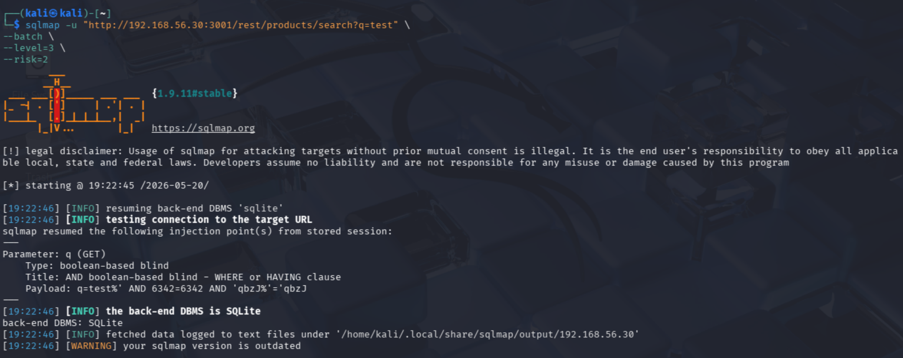
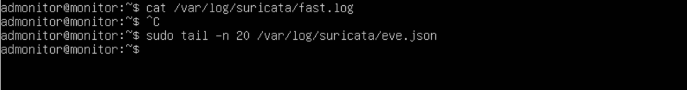

# SOC-LabLocal

> **Laboratório local de monitoramento, validação de detecção e troubleshooting de IDS**  
> Foco: Detection Engineering · Análise de Tráfego · Investigação de Detection Gaps

---

## Índice

1. [Introdução](#1-introdução)
2. [Objetivo do Case](#2-objetivo-do-case)
3. [Arquitetura do Laboratório](#3-arquitetura-do-laboratório)
4. [Serviços Monitorados](#4-serviços-monitorados)
5. [Configuração do Suricata](#5-configuração-do-suricata)
6. [Validação de Visibilidade de Rede](#6-validação-de-visibilidade-de-rede)
7. [Teste Manual de SQL Injection](#7-teste-manual-de-sql-injection)
8. [Teste Automatizado com SQLMap](#8-teste-automatizado-com-sqlmap)
9. [Detection Gap Identificado](#9-detection-gap-identificado)
10. [Hipóteses Investigadas](#10-hipóteses-investigadas)
11. [Próximos Passos](#11-próximos-passos)
12. [Estrutura do Repositório](#12-estrutura-do-repositório)
13. [Disclaimer](#13-disclaimer)

---

## 1. Introdução

Este repositório documenta um laboratório de segurança local construído com o objetivo de estudar **monitoramento de redes**, **detecção baseada em assinaturas**, **análise de tráfego** e **troubleshooting de IDS**. O ambiente foi inteiramente virtualizado utilizando VirtualBox, com VMs em rede segmentada, simulando uma infraestrutura corporativa mínima.

O foco central **não** é a execução de ataques. O foco é a **validação de capacidade de detecção**: entender se as ferramentas configuradas são capazes de identificar comportamentos maliciosos conhecidos e, quando não são, investigar **por quê**.

Este case documenta um ciclo completo de trabalho de **detection engineering**:

- Configuração do ambiente e instrumentação de telemetria
- Execução de comportamento controlado e documentado
- Análise dos logs e alertas gerados
- Identificação e investigação de um **detection gap** real
- Levantamento de hipóteses e plano de remediação



---

## 2. Objetivo do Case

O objetivo específico deste case foi responder a uma pergunta simples e direta:

> **O Suricata IDS, utilizando regras ET Open, é capaz de detectar tentativas de SQL Injection contra o OWASP Juice Shop?**

Para responder a essa pergunta de forma rigorosa, o processo passou por etapas sequenciais:

1. Validar que o ambiente de monitoramento enxerga o tráfego relevante
2. Confirmar a vulnerabilidade no alvo com técnicas manuais e automatizadas
3. Verificar se os logs do IDS registraram algum alerta
4. Caso não haja alertas, investigar as causas possíveis

O resultado foi a identificação de um **detection gap**: o SQL Injection foi confirmado com sucesso, o tráfego era visível na interface monitorada, o Suricata estava ativo com as regras ET Open carregadas — e ainda assim **nenhum alerta foi gerado**.

Esse gap é o ponto central deste documento.

---

## 3. Arquitetura do Laboratório

O ambiente é composto por quatro VMs em rede internal Network, todas na sub-rede `192.168.56.0/24`:

| VM | Sistema Operacional | IP | Função |
|---|---|---|---|
| DC01 | Windows Server 2016 | `192.168.56.10` | Active Directory / DNS |
| WKS01 | Windows 10 | `192.168.56.20` | Estação cliente simulada |
| MON01 | Ubuntu Server | `192.168.56.30` | Monitoramento / IDS / Alvos |
| ATK01 | Kali Linux | `192.168.56.40` | Origem dos testes controlados |

O Ubuntu Server (`MON01`) concentra os serviços de monitoramento e também hospeda a aplicação-alvo, permitindo que o Suricata monitore o tráfego que chega à própria máquina onde está instalado.

```
192.168.56.0/24
├── 192.168.56.10  →  Windows Server 2016  (DC / AD)
├── 192.168.56.20  →  Windows 10           (Cliente)
├── 192.168.56.30  →  Ubuntu Server        (Monitoramento + Alvo)
└── 192.168.56.40  →  Kali Linux           (Testes Controlados)
```

> As configurações de rede e os arquivos de infraestrutura estão disponíveis em `configs/`.

---

## 4. Serviços Monitorados

O `MON01` executa múltiplos serviços via Docker, permitindo uma stack de monitoramento completa lado a lado com a aplicação vulnerável utilizada nos testes.



| Serviço | Porta | Finalidade |
|---|---|---|
| **Grafana** | `3000` | Dashboards e visualização de métricas |
| **Prometheus** | `9090` | Coleta e armazenamento de métricas |
| **Zabbix** | `8080` / `10051` | Monitoramento de hosts e serviços |
| **OWASP Juice Shop** | `3001` | Aplicação web vulnerável (alvo dos testes) |

O Juice Shop foi exposto na porta `3001` pois a porta `3000` já estava ocupada pelo Grafana. Essa decisão impactou diretamente a investigação do detection gap, conforme detalhado adiante.

A composição dos containers está documentada em:

```
configs/docker/docker-compose.yml
```

---

## 5. Configuração do Suricata

O Suricata foi instalado diretamente no `MON01` (fora do Docker) para garantir visibilidade total do tráfego na interface de rede física da VM.



**Parâmetros principais:**

| Parâmetro | Valor |
|---|---|
| Modo de operação | IDS (passivo) |
| Interface monitorada | `enp0s8` |
| Método de captura | `AF_PACKET` |
| Ruleset | ET Open |
| Volume de regras carregadas | ~42 MB |





**Arquivos de log configurados:**

```
/var/log/suricata/fast.log    → Alertas em formato legível
/var/log/suricata/eve.json    → Eventos estruturados em JSON (EVE)
```

A configuração completa do Suricata está documentada em:

```
configs/suricata/suricata.yaml
```

---

## 6. Validação de Visibilidade de Rede

Antes de qualquer teste, foi necessário confirmar que o Suricata tinha visibilidade real sobre o tráfego entre `ATK01` (Kali) e o Juice Shop em `MON01`.

Esse passo é crítico: um IDS que não enxerga o tráfego não pode gerar alertas, independentemente da qualidade das regras. Validar a telemetria antes de atribuir silêncio a um "detection gap" é parte essencial da metodologia.

O `tcpdump` foi utilizado para confirmar a captura de pacotes na interface `enp0s8`:

```bash
sudo tcpdump -i any host 192.168.56.40 and port 3001
```



**Resultado:** O tráfego originado no Kali (`192.168.56.40`) destinado à porta `3001` do Juice Shop foi capturado com sucesso. A camada de visibilidade estava funcional.

Com isso, descartou-se prematuramente a hipótese de ausência de tráfego como causa do silêncio nos logs do IDS.

---

## 7. Teste Manual de SQL Injection

Com a visibilidade de rede confirmada, o próximo passo foi gerar comportamento malicioso documentado e controlado.

O endpoint `/rest/products/search` do Juice Shop aceita o parâmetro `q`, que é passado diretamente para uma query SQLite sem sanitização adequada — uma vulnerabilidade conhecida e intencional da aplicação.

**Payload utilizado:**

```bash
curl "http://192.168.56.30:3001/rest/products/search?q=%27%20UNION%20SELECT%20NULL,NULL--"
```

O payload em texto decodificado corresponde a:

```sql
' UNION SELECT NULL,NULL--
```



**Resposta da aplicação:**

A aplicação retornou um erro de SQLite expondo detalhes do backend, incluindo stack trace do Express/Node.js. Isso confirmou que:

- O payload atravessou a rede sem bloqueio
- O backend processou a query maliciosa
- A vulnerabilidade está ativa e explorável
- O tráfego contendo o payload era visível na interface monitorada

Nenhum alerta foi registrado no `fast.log` ou `eve.json` durante este teste.

---

## 8. Teste Automatizado com SQLMap

Para complementar a validação manual e gerar um volume maior de tráfego característico de SQL Injection — incluindo variações de payload que cobrem diferentes assinaturas —, o SQLMap foi executado a partir do `ATK01`.

**Comando utilizado:**

```bash
sqlmap -u "http://192.168.56.30:3001/rest/products/search?q=test" \
  --batch \
  --level=3 \
  --risk=2
```

O tcpdump foi executado em paralelo para confirmar a chegada dos pacotes na interface monitorada:



**Resultado do SQLMap:**



| Campo | Valor |
|---|---|
| Parâmetro vulnerável | `q` |
| Tipo de injeção confirmada | Boolean-based blind |
| Backend DBMS identificado | SQLite |
| Status | Vulnerabilidade confirmada |

O SQLMap confirmou a vulnerabilidade com múltiplas técnicas de detecção. O tráfego gerado foi substancial e variado — condição ideal para acionar regras baseadas em assinaturas de SQLi.

Ainda assim: **nenhum alerta foi gerado**.

---

## 9. Detection Gap Identificado

Este é o ponto central do case.

Ao verificar os logs do Suricata após os testes, o resultado foi o seguinte:



```
/var/log/suricata/fast.log  →  vazio
/var/log/suricata/eve.json  →  sem eventos de alerta
```

**Resumo do estado no momento dos testes:**

| Condição | Status |
|---|---|
| SQL Injection confirmada manualmente | ✅ |
| SQL Injection confirmada via SQLMap | ✅ |
| Tráfego visível via tcpdump na interface monitorada | ✅ |
| Suricata ativo e em execução | ✅ |
| Regras ET Open carregadas (~42 MB) | ✅ |
| Alertas gerados no fast.log | ❌ |
| Alertas gerados no eve.json | ❌ |

A ausência de alertas **não** invalida o teste. Ela levanta uma questão de detection engineering que precisa ser investigada: o silêncio é resultado de um problema de configuração, de uma limitação das regras, ou de um gap real de cobertura?

---

## 10. Hipóteses Investigadas

A ausência de alertas foi tratada como ponto de partida para uma investigação estruturada. As seguintes hipóteses foram levantadas para análise:

### 10.1 HTTP_PORTS não inclui a porta 3001

As regras ET Open para SQL Injection tipicamente utilizam a variável `$HTTP_PORTS` para delimitar o escopo de inspeção HTTP. Se essa variável estiver definida apenas com as portas padrão (`80`, `8080`, `443`), a porta `3001` — onde o Juice Shop está exposto — ficaria fora do escopo de inspeção.


### 10.2 Falha no parsing da camada de aplicação (app-layer)

O Suricata realiza inspeção de protocolos na camada de aplicação. Para que as regras de SQLi operem, o tráfego HTTP precisa ser corretamente parseado. Se o Suricata não reconhecer o tráfego na porta `3001` como HTTP, a inspeção de payload não ocorre.


### 10.3 Checksum offloading / NIC offloading

Em ambientes virtualizados, o checksum de pacotes pode ser calculado pela placa de rede virtual (offloading), resultando em pacotes com checksum inválido do ponto de vista do sistema operacional. O Suricata, dependendo da configuração, pode descartar esses pacotes ou falhar no parsing.

### 10.4 Configuração do EVE log

É possível que o `eve.json` esteja configurado para registrar apenas determinados tipos de eventos, excluindo alertas. Uma misconfiguration no bloco `outputs` do `suricata.yaml` poderia suprimir silenciosamente os alertas.


### 10.5 Ausência de regras locais customizadas

As regras ET Open são voltadas para tráfego em portas padrão e comportamentos conhecidos. Para cobrir cenários específicos do laboratório — como SQLi em porta não-padrão —, regras customizadas em `local.rules` poderiam ser criadas para validar se a engine de detecção está funcional de forma isolada.


### 10.6 Modo de captura AF_PACKET e tráfego local (loopback)

Quando a origem e o destino do tráfego são o mesmo host (conexões localhost), o AF_PACKET pode não capturar o tráfego adequadamente. No caso deste lab, o Kali está em IP diferente, portanto esta hipótese é menos provável — mas merece verificação se o tráfego fosse gerado internamente no `MON01`.

---

## 11. Continuação

Com base nas hipóteses levantadas, os próximos passos do laboratório são:

- [ ] **Validar `$HTTP_PORTS`**: Adicionar a porta `3001` à variável no `suricata.yaml` e repetir os testes
- [ ] **Verificar app-layer HTTP**: Analisar o `eve.json` em busca de eventos com `app_proto: http` na porta `3001`
- [ ] **Desabilitar NIC offloading**: Aplicar `ethtool` e testar o impacto na captura
- [ ] **Criar `local.rules`**: Implementar regras simples de validação para isolar problemas de engine vs. regras
- [ ] **Revisar configuração EVE**: Confirmar que alertas estão habilitados no bloco de outputs
- [ ] **Habilitar logging de debug do Suricata**: Analisar stderr para mensagens de erro de parsing
- [ ] **Testar com tráfego HTTP simples**: Gerar uma requisição com payload conhecido e validar se aparece no `eve.json` como `http`
- [ ] **Documentar os resultados**: Registrar cada hipótese testada com evidências de confirmação ou descarte em uma branch deste repositorio

---

## 12. Estrutura do Repositório

```
SOC-LabLocal/
│
├── README.md                          ← Este documento
│
├── configs/
│   ├── docker/
│   │   └── docker-compose.yml         ← Stack de containers (Grafana, Prometheus, Zabbix, Juice Shop)
│   └── suricata/
│       └── suricata.yaml              ← Configuração do Suricata IDS
│
└── evidence/
    └── img/
        ├── print_networkInfra_00.png       ← Infraestrutura de rede do lab
        ├── print_dockersUbuntu_01.png      ← Containers em execução no Ubuntu
        ├── print_estadoSuricata_02.png     ← Estado do serviço Suricata
        ├── print_interfaceMon_03.png       ← Interface monitorada (enp0s8)
        ├── print_listenabled-sources_04.png← Rules sources habilitados (ET Open)
        ├── print_tcpdumpTraffic_05.png     ← Captura de tráfego via tcpdump
        ├── print_manualSQLi_06.png         ← Teste manual de SQL Injection
        ├── print_tcpdumpSQLMapTraffic_07.png← Tráfego do SQLMap capturado
        ├── print_sqlmap_08.png             ← Saída e resultado do SQLMap
        └── print_logsEmpty_09.png          ← Logs vazios — detection gap
```

---

## 13. Disclaimer

Este laboratório foi construído exclusivamente para fins educacionais, em ambiente isolado e controlado, sem qualquer conectividade com redes externas ou sistemas de produção.

Todos os testes descritos neste documento foram executados contra a aplicação **OWASP Juice Shop**, uma aplicação deliberadamente vulnerável criada para fins de treinamento e educação em segurança.

O objetivo deste projeto é o desenvolvimento de habilidades em:

- Monitoramento de redes e sistemas
- Configuração e troubleshooting de IDS
- Análise de tráfego e telemetria
- Detection engineering
- Investigação de gaps de cobertura de detecção

Nenhuma das técnicas documentadas deve ser replicada contra sistemas sem autorização explícita. O uso não autorizado das técnicas descritas pode configurar crime previsto na legislação vigente, incluindo a **Lei nº 12.737/2012 (Lei Carolina Dieckmann)** no Brasil.

---

*Documentação mantida como parte do processo de aprendizado em SOC, monitoramento e detection engineering.*
