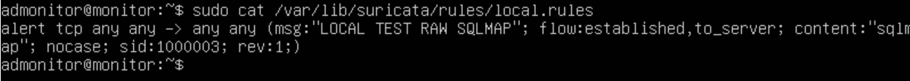
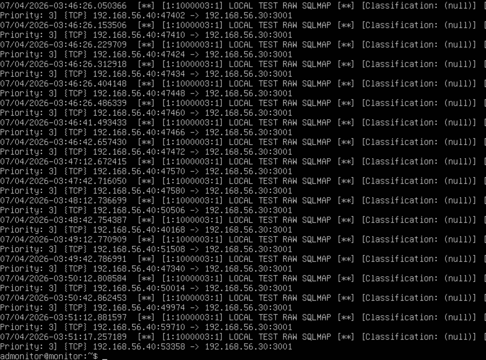
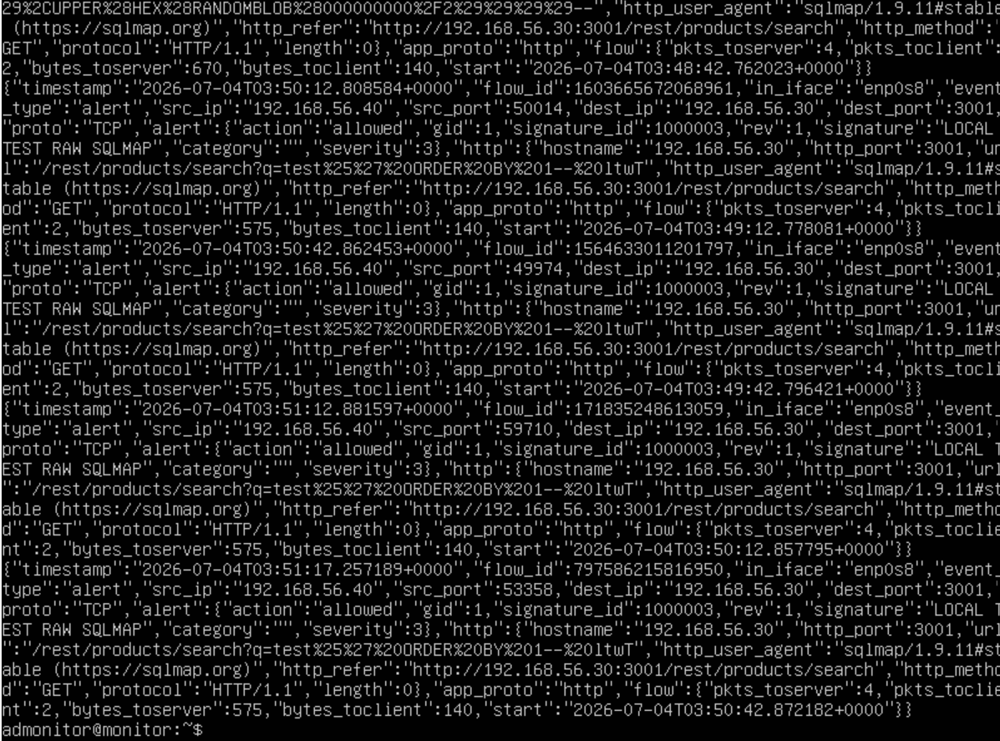

# SOC-LabLocal — Investigação: Validação da Pipeline de Detecção do Suricata

> **Branch de investigação técnica**
> Este documento não substitui o README da branch `main`. Ele registra uma investigação conduzida após o encerramento da documentação principal, a partir do detection gap identificado entre o SQLMap e o Suricata.

---

## Índice

1. [Contexto](#1-contexto)
2. [Objetivo desta Investigação](#2-objetivo-desta-investigação)
3. [Resumo do Ambiente](#3-resumo-do-ambiente)
4. [Problema Inicial](#4-problema-inicial)
5. [Hipóteses Levantadas](#5-hipóteses-levantadas)
6. [Processo de Investigação](#6-processo-de-investigação)
7. [Evidências](#7-evidências)
8. [Resultado da Investigação](#8-resultado-da-investigação)
9. [Conclusão](#9-conclusão)

---

## 1. Contexto

O README principal do projeto encerrou-se com um detection gap não resolvido: o SQLMap identificava uma SQL Injection válida contra o OWASP Juice Shop, o tcpdump confirmava que o tráfego chegava à interface monitorada, o Suricata encontrava-se ativo e as regras ET Open estavam carregadas — porém nenhum alerta era gerado.

A partir desse ponto, iniciou-se uma investigação dedicada a determinar em qual camada o problema estava localizado, entre quatro possibilidades:

- infraestrutura de rede;
- captura de pacotes;
- configuração do Suricata;
- cobertura das próprias regras ET Open.

Esta branch documenta integralmente essa investigação.

---

## 2. Objetivo desta Investigação

Antes de assumir que o gap era causado por falta de cobertura das regras ET Open, era necessário validar, de forma isolada, se a pipeline de detecção do Suricata estava funcional em todas as suas etapas — captura, parsing de protocolo, engine de regras e geração de log.

O objetivo desta investigação **não era detectar a SQL Injection em si**. O objetivo era responder a uma pergunta anterior e mais fundamental:

> **O Suricata realmente está funcionando corretamente?**

Somente após responder a essa pergunta faria sentido investigar as assinaturas ET Open.

---

## 3. Resumo do Ambiente

O laboratório utilizado é o mesmo documentado na branch `main`, na rede `192.168.56.0/24`:

| Máquina | IP | Papel |
|---|---|---|
| Windows Server 2016 | `192.168.56.10` | Infraestrutura de domínio |
| Windows 10 | `192.168.56.20` | Estação cliente |
| Ubuntu Server (Monitoramento) | `192.168.56.30` | Suricata, Docker, Juice Shop, Grafana, Prometheus, Zabbix |
| Kali Linux | `192.168.56.40` | Origem dos testes controlados |

A arquitetura completa, os serviços expostos e a configuração de rede já estão documentados na branch `main` e não são repetidos aqui.

---

## 4. Problema Inicial

No momento em que esta investigação foi iniciada, o cenário observado era o seguinte:

| Condição | Status |
|---|---|
| SQLMap encontrando SQL Injection | ✔ |
| tcpdump capturando o tráfego na interface monitorada | ✔ |
| Suricata ativo | ✔ |
| Regras ET Open carregadas | ✔ |
| Alertas em `fast.log` | ✘ |
| Alertas em `eve.json` | ✘ |

A combinação de tráfego confirmado, engine ativa e regras carregadas — sem qualquer alerta correspondente — indicava que o problema não estava necessariamente nas regras, mas poderia estar em qualquer etapa anterior da pipeline.

---

## 5. Hipóteses Levantadas

Para conduzir a investigação de forma estruturada, foram levantadas as seguintes hipóteses:

**HTTP_PORTS**
As regras de SQLi da ET Open dependem da variável `$HTTP_PORTS` para delimitar o escopo de inspeção HTTP. Caso essa variável não incluísse a porta `3001`, usada pelo Juice Shop, o tráfego nunca seria avaliado como HTTP pelas regras que dependem dessa porta.

**app-layer HTTP**
Mesmo com o tráfego chegando à interface, era necessário confirmar que o Suricata estava efetivamente reconhecendo e parseando esse tráfego como protocolo HTTP na camada de aplicação. Sem esse parsing, as regras de inspeção de payload HTTP não seriam avaliadas.

**Checksum offloading**
Em ambientes virtualizados, o cálculo de checksum pode ser delegado à interface de rede virtual. Isso pode fazer com que o Suricata veja pacotes com checksum aparentemente inválido, levando ao descarte silencioso durante o parsing.

**Configuração do eve.json**
Era possível que o bloco de `outputs` no `suricata.yaml` estivesse habilitando apenas alguns tipos de evento, deixando de registrar alertas mesmo quando estes fossem gerados internamente pela engine.

**AF_PACKET**
O método de captura configurado no Suricata (`AF_PACKET`) poderia, em cenários específicos de virtualização, apresentar comportamento diferente do esperado na entrega de pacotes à engine, mesmo com o tcpdump confirmando a captura na mesma interface.

**local.rules**
Por fim, levantou-se a possibilidade de que a própria engine de regras, independente do ET Open, não estivesse processando corretamente os pacotes — hipótese que só poderia ser confirmada ou descartada com uma regra de teste isolada, fora do conjunto ET Open.

---

## 6. Processo de Investigação

A investigação foi conduzida de forma incremental, isolando uma variável por vez.

### 6.1 Ajuste de HTTP_PORTS

A variável `HTTP_PORTS` foi ajustada para incluir a porta `3001`, utilizada pelo Juice Shop.

**Resultado:** eventos HTTP passaram a aparecer corretamente no `eve.json`.

**Conclusão:** o parser HTTP do Suricata estava funcional; a ausência da porta `3001` no escopo de inspeção HTTP era, de fato, um fator relevante, e essa hipótese foi confirmada como parcialmente responsável pela falta de visibilidade sobre o tráfego HTTP.

### 6.2 Validação do eve.json

Com o `HTTP_PORTS` corrigido, o `eve.json` foi inspecionado novamente.

**Conclusão:** o Suricata escrevia corretamente os eventos HTTP no formato EVE, descartando problema de configuração de output para esse tipo de evento.

### 6.3 Validação do fast.log

Apesar da correção anterior, o `fast.log` continuava sem qualquer alerta relacionado à SQL Injection.

**Conclusão:** a hipótese de falha nas regras ET Open permanecia em aberto, agora com a captura e o parsing HTTP já validados como funcionais.

### 6.4 Criação de regra local de teste

Para isolar definitivamente a engine de detecção do conjunto de regras ET Open, foi criada uma regra simples em `local.rules`:

```
alert tcp any any -> any any (msg:"LOCAL TEST RAW SQLMAP"; flow:established,to_server; content:"sqlmap"; nocase; sid:1000003; rev:1;)
```

A regra foi propositalmente simples e genérica — baseada em `content` sem qualquer dependência de `app-layer`, porta específica ou assinatura complexa. O objetivo era eliminar variáveis: se essa regra disparasse, a engine estaria comprovadamente funcional, restando isolar o problema exclusivamente nas assinaturas ET Open.

### 6.5 Novo teste com SQLMap

Com a `local.rules` carregada, o teste com SQLMap foi repetido.

**Resultado:**

- alerta gerado corretamente no `fast.log`;
- alerta gerado corretamente no `eve.json`;
- a regra local disparou conforme esperado, identificando a assinatura da ferramenta no tráfego.

---

## 7. Evidências

**Regra local carregada:**



**Alerta gerado no fast.log:**



**Alerta gerado no eve.json:**



---

## 8. Resultado da Investigação

Com os testes realizados, foi possível descartar, em sequência:

- problemas de captura de pacotes na interface monitorada;
- problemas na engine de processamento do Suricata;
- problemas no parser da camada de aplicação HTTP;
- problemas de geração de alertas pela engine;
- problemas na escrita do `eve.json`;
- problemas na escrita do `fast.log`.

A regra local disparando corretamente, com o mesmo tráfego que não gerava nenhum alerta via ET Open, demonstra que a pipeline completa do IDS — captura, parsing, engine e logging — encontra-se funcional.

A hipótese restante passa a ser:

> As regras ET Open utilizadas não possuem cobertura adequada para os payloads específicos gerados pelo SQLMap moderno, ou dependem de assinaturas excessivamente específicas que não casam com o tráfego produzido nos testes.

Essa hipótese **ainda não foi confirmada** e será tratada como ponto de partida da próxima branch.

---

## 9. Conclusão

Esta investigação encerra a validação estrutural da pipeline de detecção do Suricata neste laboratório. Foi confirmado que a infraestrutura de captura, o parsing HTTP, a engine de regras e os mecanismos de logging (`fast.log` e `eve.json`) operam corretamente quando expostos a uma regra de teste simples.

As próximas etapas serão dedicadas exclusivamente à análise das assinaturas ET Open relacionadas a SQL Injection e ao desenvolvimento de regras customizadas capazes de cobrir os payloads gerados pelo SQLMap contra o Juice Shop.

---

*Documentação mantida como parte do processo de investigação em detection engineering do projeto SOC-LabLocal.*
